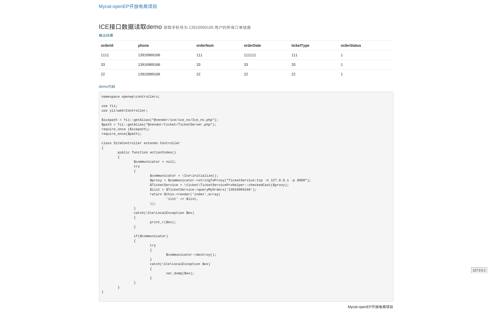

Mycat-openEP开放电商项目前端商城PHP实现
===

###Demo示例截图###
 

本项目是Mycat-openEP的一部分，以Yii2框架实现的电商网站.不包含后台管理功能，只实现前端的商品展示及购买流程支付等电商功能．

### Docker环境部署  ###

#### 下载安装 [docker镜像openep-php-v1.2.tar.gz] (http://pan.baidu.com/s/1bn2XSZl) ####

`注意： -v 参数请根据实际情况作调整; 下文中 7733d06d3225 请根据实际的IMAGE ID作替换 `

```bash
#导入images
$ cat openep-php-v1.2.tar.gz | docker import - openep-php:v1.2
#查看
$ docker images
#类似如下输出则表明导入成功
REPOSITORY     TAG           IMAGE ID            CREATED             VIRTUAL SIZE
openep-php      v1.2         7733d06d3225    6 minutes ago       1.652 GB
#启动一个container(可参考tool-scripts/run-php.sh脚本)
#这里作了一些端口映射，将宿主机的一些端口请求转发到docker容器中相关的服务,不明白的请先自行补习docker相关知识
#注意这里的-v参数并未涉及下文提到到/opt/www/openep目录进行映射相关操作
$ docker run --privileged -d \
-p 2222:2222 \
-p 8081:80 \
-p 8082:8080 \
-p 2181:2181 \
-p 3366:3306 \
-p 8066:8066 \
-p 9066:9066 \
-p 4061:4061 \
-p 8888:8888 \
-p 9001:9001 \
-h openep-php \
--name openep-php \
-v /opt/data-vol:/opt/data-vol \
-v /opt/docker/store1:/opt/data-ext \
7733d06d3225 /usr/bin/supervisord

#通过如下命令查看是否有NAMES为openep-php的容器成功启动
$docker ps

#容器启动成功后，可通过ssh登录到容器中进行操作(root用户默认密码:123456)
$ ssh root@127.0.0.1 -p2222
```


####  docker启动命令目录映射参数 -v 说明 ####

在实际开发的过程中，Docker通常只作为开发环境，PHP代码是放在宿主机中的，这时通过目录映射，可将宿主机上的代码目录与容器共享，这样就可以在宿主机上进行代码编写，让Docker仅提供程序运行环境

假设宿主机项目代码所在路径为:

```bash
         /data/github/Mycat-openEP/shop-web/php
```

在启动docker容器时，添加如下参数将宿主机中的PHP项目代码目录映射到容器中的 /opt/www/openep:

```bash
       -v /data/github/Mycat-openEP/shop-web/php:/opt/www/openep

# 调整后我们的容器启动命令变为下面这样
$ docker run --privileged -d \
-p 2222:2222 \
-p 8081:80 \
-p 8082:8080 \
-p 2181:2181 \
-p 3366:3306 \
-p 8066:8066 \
-p 9066:9066 \
-p 4061:4061 \
-p 8888:8888 \
-p 9001:9001 \
-h openep-php \
--name openep-php \
-v /opt/data-vol:/opt/data-vol \
-v /opt/docker/store1:/opt/data-ext \
-v /data/github/Mycat-openEP/shop-web/php:/opt/www/openep \
7733d06d3225 /usr/bin/supervisord

```

>关于docker启动，请阅读[Mycat Openep Docker 使用说明](../../docker/README.md)


#### nginx配置说明 ####

经过以上对`/opt/www/openep`目录进行映射的步骤, 成功启动docker容器，登录到容器中进行nginx虚拟主机配置 (nginx主机配置文件路径为/etc/nginx/conf.d)

下面例子中我们配置一个php.openep.com的虚拟主机指向项目的 /opt/www/openop目录(也就是宿主机的/data/github/Mycat-openEP/shop-web/php目录)

请注意这里的两个openep；我们上面已经将容器中的/opt/www/openep目录映射为电商php项目的shop-web/php目录，Yii框架的入口文件在 php/openep/web下

```bash

#nginx host配置
server {
      server_name php.openep.com;
      root /opt/www/openep/openep/web;
      location / {
          try_files $uri $uri/ /index.php;
          include php.conf;
          include expire.conf;
      }
      access_log /var/log/nginx/php.openep.com.log main;
}
#* 重启nginx
supervisorctl restart nginx
```

配置完容器中的nginx后，还需要修改宿主机的hosts文件，将配置的域名指向本机．
完成以上配置后，访问 `http://php.openep.com:8081`,即能访问到php电商项目程序了

说明：
>* `现在访问可能看到的是一堆ice异常输出信息，不要紧，这已经证明你的docker环境可以正常运行了．因为ice服务端相关的东西现在还没能加入到docker镜像里来，我们现在还调用不到相关服务．这一部分正在紧张进行中，请持续关注本项目``

```bash
127.0.0.1  php.openep.com
```


----------------------以下旧文档已失效------------------------

###~~使用[百度云盘下载的docker镜像](http://pan.baidu.com/s/1dDew2m1)遇到的一些问题~~

* ~~修改yum源配置文件/etc/yum.repos.d/thirdparty.repo~~
~~原因是系统中部分工具不全，需要使用yum升级安装，默认设置的yum源不正确~~

```bash
vim /etc/yum.repos.d/thirdparty.repo
#修改以下信息
[priv]
name=Priv Yum Repository
#baseurl=http://192.168.88.65/yumP
baseurl=http://mirrors.163.com/centos/$releasever/os/$basearch
```

* ~~PHP扩展补充~~
~~GD库安装~~
```bash
yum -y --enablerepo=remi,remi-php56 install php-gd
```


###~~Docker环境部署~~###

* ~~重新编译docker镜像中的IcePHP.so扩展~~
~~Docker镜像中默认安装的php版本和IcePHP.so扩展不匹配导致Ico无法使用，所以重新进行编译~~

```bash
$ git clone https://github.com/zeroc-ice/ice
$ git checkout  v3.5.1
$ cd ice/php
＃编辑
$ vim  config  Make.rules.php

#此项可自行决定是否修改，不修改编译后的Ice将被安装到容器的/opt/Ice-3.5.1目录下
#prefix ?= /opt/Ice-$(VERSION)
#因为yii2需要命令空间支持，所以我们编辑ice的编译配置文件，让编译的ice库代码以命名空间方式生成
#USE_NAMESPACES          = yes

$make
$make install

#编译完成后，将编译得到的IcePHP.so扩展放到php扩展目录,重启php，查看ice
#扩展是否正常加载成功
/opt/Ice-3.5.1/php/IcePHP.so /usr/lib64/php/modules/IcePHP.so
```
> ~~注意~~
> * ~~编译成功后/opt/Ice-3.5.1/php目录需要放到php的include_path路径中~~
> * ~~项目代码中已经有针对php5.6.11编译好的IcePHP.so扩展文件，可直接使用,将其拷贝到容器中的`/usr/lib64/php/modules/IcePHP.so`目录,配置php加载即可~~
> * ~~项目代码shop-web/php/vendor/ice文件夹下的ice_ns目录为ice运行需要的php文件~~

~~配置完成后,登录容器,进入ice管理后台,启动订单服务~~
~~前台访问绑定的域名，即可成功运行demo~~
```bash
#使用默认密码123456登录docker容器
$ ssh root@127.0.0.1 -p2222
$ icegridadmin -u root -p 123456  --Ice.Default.Locator="IceGrid/Locator:tcp -h localhost -p 4061"
$ server start TicketOrderServer1
```